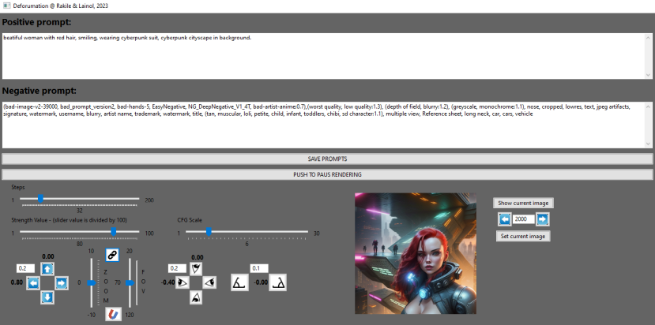
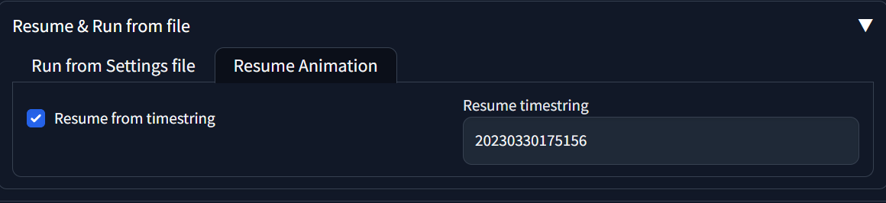

BIG DISCLAIMER!!!

!!!THERE WILL BE NO DEFORUM SUPPORT IF YOU USE THIS EXTENSION!!!
!!!THERE WILL BE NO DEFORUM SUPPORT IF YOU USE THIS EXTENSION!!!
!!!THERE WILL BE NO DEFORUM SUPPORT IF YOU USE THIS EXTENSION!!!
!!!THERE WILL BE NO DEFORUM SUPPORT IF YOU USE THIS EXTENSION!!!

# deforumation
A GUI to remotely steer the Deforum motions, strengths, and prompts, in real time. It is also possible to rewind, forward and resume, in order to fix a bad outcome.

## Dependencies
wxPython (pip install wxPython).

The version of deforum needs to be "Deforum extension for auto1111 webui, v2.3b".

More precisely I changed the animation.py with sha1sum of (1aca4ae71fefabe2a8b17f977fc28f3157c14d56),
and render.py with the sha1sum of (94121a91bf88d36c065cdaa07ea72c8c7a8b0aa2).

## Introduction
As a big fan of deforum, I did this small "Hack" in order to remotely be able to change motion values while deforum is rendering.

## Getting started
In order for deforumation to work, the files "animation.py" and "render.py" need to be replaced with the ones provided in "deforum-for-automatic1111-webui\scripts\deforum_helpers".

Two files will be created in "C:\Temp" when the application is started, "prompt.txt" and "prompt.txt.locked", so be sure that you have a Temp folder on "C:\".
These two files are used as the communication between Deforum and Deforumation.

## How it works
In the Deforum extention in the Keyframes TAB, you have to choose "3D", else it will not work.
Before pushing "Generate" in the deforum extention, prime the communication by inserting a Positive and a Negative prompt in the Deforumation GUI.

To apply any text changes, you then have to push the "SAVE PROMPTS" button (this will create a file in your path C:\Temp\prompt.txt)
You may also set any strength value or other values in beforehand. Also, moving any sliders or pushing any buttons will automatically save all other values (prompts included).

Now that this is done, push the "Generate" button in the Deforum extention.
You may now play around with all the values (Panning, Rotating, Tilting, Zoom, Strength Value, CFG value, Sample steps, and of course Prompts, positive and negative) as deforum keeps generating images and applying the new values.

Easy to control exakt motions (above, doing a Panning left while at the same time Rotating right, creatinging an orbit camera movement around the person). The settings for this movement is shown in the Deforumation interface below.

## Pause, rewind, and rerender
Deforumation allows you to rewind to a given frame, and gives you the ability to start generating from that given frame. This is good for when something in your creativity "goes bananas". Maybe that clown shouldn't have appeard all of a sudden ;P

In order to use this functionality, you have to turn on "Resume from timestring".

The suggested method is to just start generating without this functionality turned on. Then Deforum will create a folder for you with a timestring. Interupt the generation, and use that time string in the "Resume timestring" field. Then turn on "Resume from timestring", and you should be good to go.

When you know you did a misstake, start by pressing the "PUSH TO PAUS RENDERING"-button. Then click "Show current image"-button. This will give you the current image, and the current actual frame number. Use the arrows to rewind or forward... or you could just type in a frame number and press enter to jump to that frame... When you found the frame where you want to resume rendering from, press the "Set current image"-button, and then, to resume rendering, push the "PUSH TO RESUME RENDERING"-button. EASY!!!

Here is an example of LIVE prompt changing for facial expression during rendering.

Positive Prompt: Beatifull (smiling:0.1), bear girl, focus on face

Here we just increase the "(smiling:0.1)" value upwards. 

## A tool for learning
Deforumation is a perfect tool to learn how different parameters, like Steps, Strength Value and CFG scale, in combination affect the image generation over time. The best way (I have found, to get as a stable outcome as possible with all other settings you have in Deforum), is to know your values.

One way to achieve this is to have No motion at all, and make every render not go into "Bananas"... Because the most effective values differ alot between samplers, checkpoints, SD VAE's and all other specific settings that you are currently having. Get a feel of what values, keep a balance with your current choices. Note them down, and play around ;P

## Trouble shooting
If the rendering shouldn't work (freezes), it might be because there is still a lock file that hasn't been released (C:\TEMP\prompt.txt.locked). This file is used in order for Deforum and Deforumation not to deadlock each-other. Just manually delete it if that should happen.
Normally, you will see alot of "Waiting for lock file", in the command line interface that you started Automatic1111 from.
