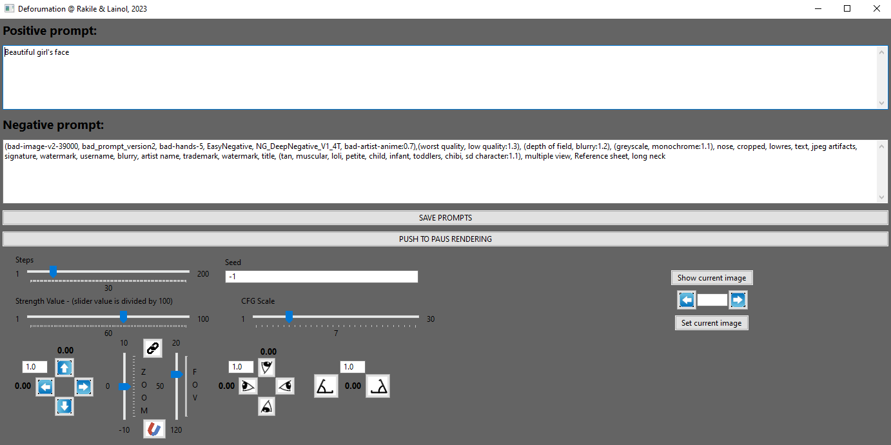

BIG DISCLAIMER!!!

!!!THERE WILL BE NO DEFORUM SUPPORT IF YOU USE THIS EXTENSION!!!
!!!THERE WILL BE NO DEFORUM SUPPORT IF YOU USE THIS EXTENSION!!!
!!!THERE WILL BE NO DEFORUM SUPPORT IF YOU USE THIS EXTENSION!!!
!!!THERE WILL BE NO DEFORUM SUPPORT IF YOU USE THIS EXTENSION!!!

# deforumation
A GUI to remotely steer the Deforum motions, strengths, and prompts, in real time. It is also possible to rewind, forward and resume, in order to fix a bad outcome.

## Dependencies
wxPython (pip install wxPython).

## Installation
Get the repo through: git clone https://github.com/Rakile/deforumatio  or download the zip file and unpack somewhere.

Replace the two files, located in your Automatic1111 path: ".\stable-diffusion-webui\extensions\deforum-for-automatic1111-webui\scripts\deforum_helpers\"
with the two from ".\deforumation\deforum-for-automatic1111-webui\scripts\deforum_helpers\"

Be sure to restart Automatic1111 after this.

Go into the deforumation folder in your terminal and start by running:

>python -m pip install -r requirements.txt

## Running
There are two parts, the "Mediator" and the Application (Deforumation GUI).

Start by running the Mediator, which is located in the deforumation folder (mediator.py):

>python mediator.py

Then you can start the acctual application from another terminal, with:

>python deforumation.py

## Introduction
As a big fan of deforum, I did this small "Hack" in order to remotely be able to change motion values and others, while deforum is rendering.

The Mediator is running a websocket server that becomes the communication channel between Deforum and deforumation... Altough, any application could communicate with deforum through the Mediator (So go make some video editing applications that look better than mine ;P)

## How it works
In the Deforum extention in the Keyframes TAB, you have to choose "3D", else it will not work.
Before pushing "Generate" in the deforum extention, prime the communication by inserting a Positive and a Negative prompt in the Deforumation GUI.

To apply any text changes, you then have to push the "SAVE PROMPTS" button.
You may also set any strength value or other values in beforehand. Also, moving any sliders or pushing any buttons will automatically save all other values (prompts included). The file that is being saved is located inside the deforumation folder (deforumation_settings.txt), and will keep you settings during a restarts.

Now that this is done, push the "Generate" button in the Deforum extention.
You may now play around with all the values (Panning, Rotating, Tilting, Zoom, Strength Value, CFG value, Sample steps, and of course Prompts, positive and negative) as deforum keeps generating images and applying the new values.

Easy to control exakt motions (above, doing a Panning left while at the same time Rotating right, creatinging an orbit camera movement around the person). The settings for this movement is shown in the Deforumation interface below.

To change the seed, just type a new seed in the seed-input box, and push return. It will then be loyal to whatever you have choosen in the Deforum GUI, iterative, etc.

## Pause, rewind, and rerender
Deforumation allows you to rewind to a given frame, and gives you the ability to start generating from that given frame. This is good for when something in your creativity "goes bananas". Maybe that clown shouldn't have appeard all of a sudden ;P

In order to use this functionality, just push "Show current image" during generation, and you will see the current image currently rendering, along with the framenumber.

Rsume from timestring is also supported:

When you know you did a misstake, start by pressing the "PUSH TO PAUS RENDERING"-button. Then click "Show current image"-button. This will give you the current image, and the current actual frame number. Use the arrows to rewind or forward... or you could just type in a frame number and press enter to jump to that frame... When you found the frame where you want to resume rendering from, press the "Set current image"-button, and then, to resume rendering, push the "PUSH TO RESUME RENDERING"-button. EASY!!!

 

Here is an example of LIVE prompt changing for facial expression during rendering.

Positive Prompt: Beatifull (smiling:0.1), bear girl, focus on face

Here we just increase the "(smiling:0.1)" value upwards. 

## A tool for learning
Deforumation is a perfect tool to learn how different parameters, like Steps, Strength Value and CFG scale, because, in a combination they affect the image generation over time. The best way (I have found, to get as a stable outcome as possible with all other settings you have in Deforum), is to know your values.

One way to achieve this is to have No motion at all, and make every render not go into "Bananas"... Because the most effective values differ alot between samplers, checkpoints, SD VAE's and all other specific settings that you are currently having. Get a feel of what values, keep a balance with your current choices. Note them down, and play around ;P

## Trouble shooting
Be sure that the Mediator is upp and running! Else no communication can be had between Deforum and Deforumation!
