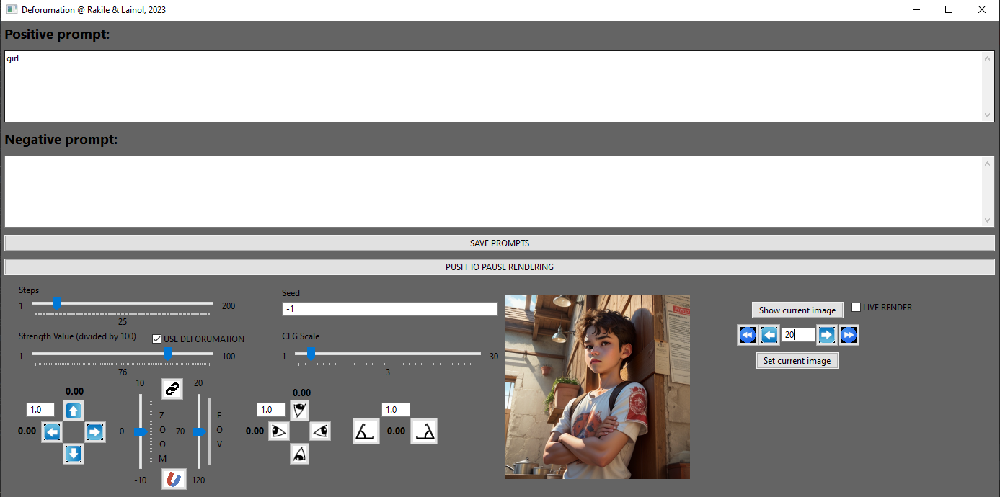

`BIG DISCLAIMER!!!`

`!!!THERE WILL BE NO DEFORUM SUPPORT IF YOU USE THIS EXTENSION!!!`
`!!!THERE WILL BE NO DEFORUM SUPPORT IF YOU USE THIS EXTENSION!!!`
`!!!THERE WILL BE NO DEFORUM SUPPORT IF YOU USE THIS EXTENSION!!!`
`!!!THERE WILL BE NO DEFORUM SUPPORT IF YOU USE THIS EXTENSION!!!`

Here they are by the way: https://github.com/deforum-art/deforum-for-automatic1111-webui

# Discord Channel

https://discord.gg/R9XFP8MN

# deforumation
A GUI to remotely steer the Deforum motions, strengths, and prompts, in real time. It is also possible to rewind, forward and resume, in order to fix a bad outcome.
Be aware that if you choose to install Deforumation, it needs to be (at current moment), running, always, in order for Deforum to work when rendering.

## Dependencies, And deforum version

When Deforum is updated deforumation will stop working. As of now 2023-04-14 it works.

If the latest version of Deforum shouldn't be working with Deforumation:

              This link provides the bare deforum files of an older working version, does not contain python packages, 4 meg download

              https://drive.google.com/file/d/1dp2LkQ25T1W3fD7w3a01OX4weFKxGgHy/view?usp=share_link

              This link provides deforum files of an older working version, including python packages, 130 meg download

              https://drive.google.com/file/d/1fWGi219p7qcrKlZheQ0GB1XeVctO10Nv/view?usp=share_link

              use this link to download a version of Deforum extension that Deforumation is compatible with.
              It`s to much work to redo the programming every time Deforum is updated. 
              When Deforum developers have implemented a communication module for third-party apps things will be much easier. 
              No compatibility issues when Deforum is updated.

## Ongoing work

Below you se the draft for the new Deforumation UI.  Many new features like the ability to customize the layout
and choose what values you work with during the animation rendering process. There will also be support to control
the movements using a joystick or game-pad. The paus, rewind and redo function will be the "animation player".

The prompting can be done in traditional way by having the complete prompt in one prompt-input box. 
But as shown in the UI you will also have the ability to make separate prompting input boxes(and adjust the prio) for easier prompting.

And to the left there will be a drop down list for automated macros, like facial expression styles, automated blinking.
Or whatever your imagination can come up with.

## Installation
Get the repo through: `git clone https://github.com/Rakile/deforumation`  or download the zip file and unpack somewhere and unpack it.

Replace the now three files, located in your Automatic1111 path: ".\stable-diffusion-webui\extensions\deforum-for-automatic1111-webui\scripts\deforum_helpers\"
with the three files downloaded from deforumation: ".\deforumation\deforum-for-automatic1111-webui\scripts\deforum_helpers\"

Be sure to restart Automatic1111 after this.

Go into the deforumation folder in your terminal and start by running:

`>python -m pip install -r requirements.txt`

## Running
There are two parts, the "Mediator" and the Application (Deforumation GUI).

Start by running the Mediator, which is located in the deforumation folder (mediator.py):

`>python mediator.py`

Keep the mediator CMD open, its needed for the communication between deforum and deforumation.

Then you can start the acctual application from a new terminal, with:

`>python deforumation.py`

## Introduction
As a big fan of deforum, I did this small "Hack" in order to remotely be able to change motion values and others, while deforum is rendering.

The Mediator is running a websocket server that becomes the communication channel between Deforum and deforumation... Altough, any application could communicate with deforum through the Mediator (So go make some video editing applications that look better than mine ;P)

## How it works
Watch this video to get a feeling of how to use Deforumation... or read on below.

## Recommended setting

In settings, Live previews recommends this setting. This gives you better visual feedback. 

In the Deforum extention in the Keyframes TAB, you have to choose "3D", else it will not work.
Before pushing "Generate" in the deforum extention, prime the communication by inserting a Positive and a Negative prompt in the Deforumation GUI.

To apply any text changes, you then have to push the "SAVE PROMPTS" button.
You may also set any strength value or other values in beforehand. Also, moving any sliders or pushing any buttons will automatically save all other values (prompts included). The file that is being saved is located inside the deforumation folder (deforumation_settings.txt), and will keep you settings during a restarts.

Now that this is done, push the "Generate" button in the Deforum extention.
You may now play around with all the values (Panning, Rotating, Tilting, Zoom, Strength Value, CFG value, Sample steps, and of course Prompts, positive and negative) as deforum keeps generating images and applying the new values.

!!!BE AWARE!!!
Deforumation now adds the values to any scheduled motion. That means that if you have scheduled ANY motions inside of Deforum, like "Translation X" or "Rotation 3D Y", or whatever, they will be added to your manual values done through Deforumation. Be aware that "Translation Z" is by default set to "0:(1.75)"... If you don't want this influence, and only want Deforumation to controll all values, you need to set this to 0:(0). We added this feature, because we think you still want to add a musical flow through the Deforum scheduling.

## Interface

There are alot of controls, but here comes the basics:
Panning:

The buttons will move the camera. So if you push the left arrow, the camera will go left, and the "object" will pan right... etc

The "1.0" box decides how much of the value will be applied when you push a button.

Think of yourself being the eyes (tyhye camera view)... so if you push the left button, then you'r head will turn left... etc

The "1.0" box decides how much of the value will be applied when you push a button.

Tilt is tilt... It will rotate the image clock or counter clock-wise.

The "1.0" box decides how much of the value will be applied when you push a button.

This part is useful to rewind and forward througout a rendering. When you have started a rendering, you can look at the current image by pressing the "Show current image" or you can also click anywhere else that is bnot a button on the GUI, to update the image.

A suggestion before using any of these option is to push the "PUSH TO PAUSE RENDERING BUTTON". The rendering will pause and you can more easily explore the functionalities.

The "left-arrow"-button shows you the image previous to the current, and the "right-arrow"-button" shows you the next image to the current.

The "double-left-arrow" will jump to your closest saved prompt towards the beginning relative to your current frame, and the "double-right-arrow" will jump to your closest saved prompt towards the end relative to your current frame.

When you know you did a misstake, start by pressing the "PUSH TO PAUS RENDERING"-button. Then click "Show current image"-button. This will give you the current image, and the current actual frame number. Use the arrows to rewind or forward... or you could just type in a frame number and press enter to jump to that frame... When you found the frame where you want to resume rendering from, press the "Set current image"-button, and then, to resume rendering, push the "PUSH TO RESUME RENDERING"-button. EASY!!!

Pushing the "SAVE PROMPTS" button will save your current prompts (positive and negative), as files inside the "prompts" folde in your deforumation folder. Depending on your current generation (timestring), seperate files will be saved for that particular "project". That means that your prompts can be recalled during a generation of a specific project. E.g. Push "SAVE PROMPT" on fram 0, then on fram 50 change your prompts, and push again "SAVE PROMPTS", and they will update as you rewind/forward throughout you generated frames... You'll get a hang of it ;) (Else ask in the discord).

 

To change the seed, just type a new seed in the seed-input box, and push return. It will then be loyal to whatever you have choosen in the Deforum GUI, iterative, etc.

Deforumation allows you to rewind to a given frame, and gives you the ability to start generating from that given frame. This is good for when something in your creativity "goes bananas". Maybe that clown shouldn't have appeard all of a sudden ;P

## Random example
Here is an example of LIVE prompt changing for facial expression during rendering.

Positive Prompt: Beatifull (smiling:0.1), bear girl, focus on face

Here we just increase the "(smiling:0.1)" value upwards. 

## A tool for learning
Deforumation is a perfect tool to learn how different parameters, like Steps, Strength Value and CFG scale, because, in a combination they affect the image generation over time. The best way (I have found, to get as a stable outcome as possible with all other settings you have in Deforum), is to know your values.

One way to achieve this is to have No motion at all, and make every render not go into "Bananas"... Because the most effective values differ alot between samplers, checkpoints, SD VAE's and all other specific settings that you are currently having. Get a feel of what values, keep a balance with your current choices. Note them down, and play around ;P

## Tips and tricks
When you push "Interupt", sometimes Deforum buggs out and it doesn't stich up your video correctly. An easy way to avoid/bypass this with the help of Deforumation, is to first push the "PUSH TO PAUS RENDERING OPTION", and after the rendering has paused, then push the "Interrupt"-button. Then in Deforumation resume the flow again by pushing the "PUSH TO RESUME BUTTON" in Deforum. This will mostly get Deforum to get the stitching correctly started.

## Trouble shooting
Be sure that the Mediator is upp and running! Else no communication can be had between Deforum and Deforumation!

## Examples of using Deforumation (Give a shout if you want to be here)
By Lainol, Live prompting, facial expression:

## Example 2
By Lainol, Live prompting, facial expressions and more .

Aiwakening.

## Last thoughts
There might be an ongoing discussions on how to implement this into Deforum, so that updates will be more smoth and accordance with Deforum... As of now it remains a Hack... Never the less, we encourage users to test Deforumation, and understand how vital this concept is for creating anything with precision (not looking like an LSD trip). Please post videos, tutorials or, whatever, whith how you use Deforum, through Deforumation to your advantage. Join the r/deforumation channel (https://www.reddit.com/r/deforumation/).
